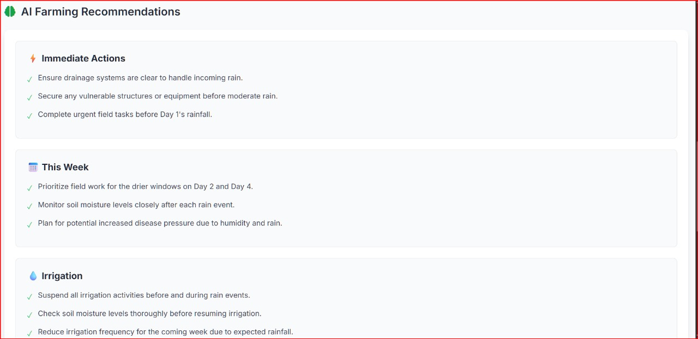

# FarmaA - by TEAM DENIERS

Problem Statement : Farmers face critical challenges in managing crops due to unpredictable weather, limited access to real-time forecasts, and lack of actionable agricultural guidance. Traditional weather apps provide raw forecasts but fail to translate data into practical farming decisions. This gap results in poor irrigation planning, crop damage from extreme conditions, and missed opportunities for timely planting or harvesting. Small and marginal farmers, who often lack expert advisory access, are the most vulnerable

Proposed Solution: Farma   Smart Farming Weather Advisory
Farma is an AI-powered, farmer-centric web application that combines real-time weather data with actionable agricultural insights.
•	Location-Aware Forecasting: Automatically detects farmer’s location or allows manual entry, providing localized 7 day weather forecasts.
•	Smart Weather Mapping: Interactive maps powered by OpenStreetMap and Leaflet show precise farm locations with weather overlays.
•	AI Driven Farming Advice: Integrates Google Gemini AI to analyze weather trends and deliver short, practical recommendations across five critical categories:
o	Immediate Actions
o	Weekly Planning
o	Irrigation Management
o	Crop Protection
o	Harvesting & Planting
•	Risk Alerts: Real-time alerts for extreme heat, frost, high winds, and humidity help farmers protect crops proactively.
•	Simple, Farmer-Friendly UI: Clean, responsive interface with multilingual adaptability ensures accessibility even in rural regions.

